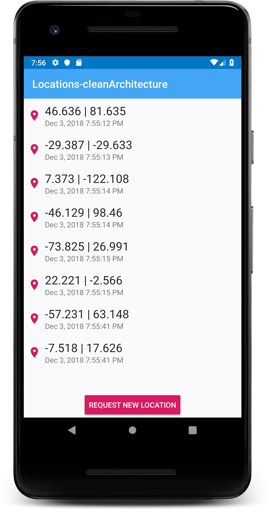

# Locations-CleanArchitecture

Project based in [*clean-architecture*](https://github.com/antoniolg/clean-architecture) project from Antonio Leiva, following [*this post*](https://devexperto.com/clean-architecture-android/).

I used MVVM with [*LiveData*](https://developer.android.com/topic/libraries/architecture/livedata) and [*ViewModel*](https://developer.android.com/topic/libraries/architecture/viewmodel) instead of MVP in the presentation layer. And I have planned to do the following:
- Use [*Room*](https://developer.android.com/topic/libraries/architecture/room) to store new locations and get the saved locations.
- Use [*Dagger*](https://google.github.io/dagger/) for dependency injection.
- Use [*RxJava*](https://github.com/ReactiveX/RxJava) for concurrency.

So this is a work in progress to try all of these in the same project.

* * *

